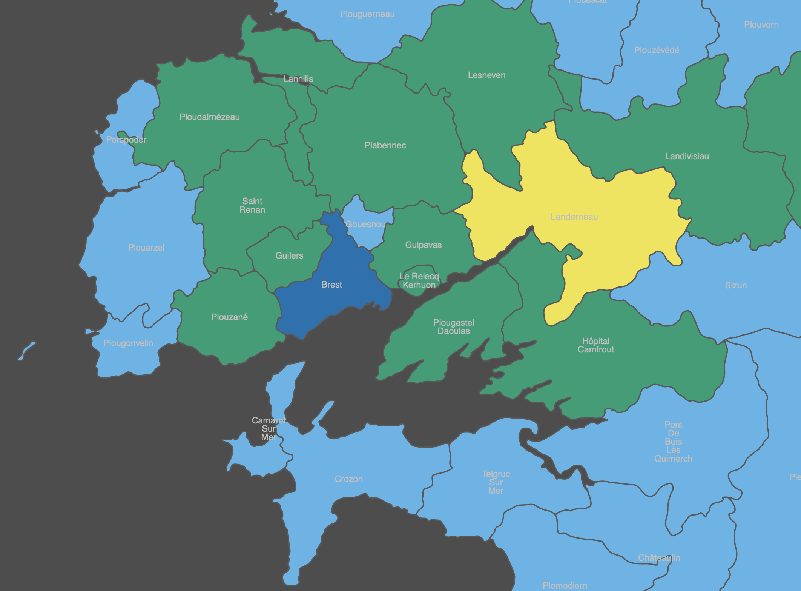
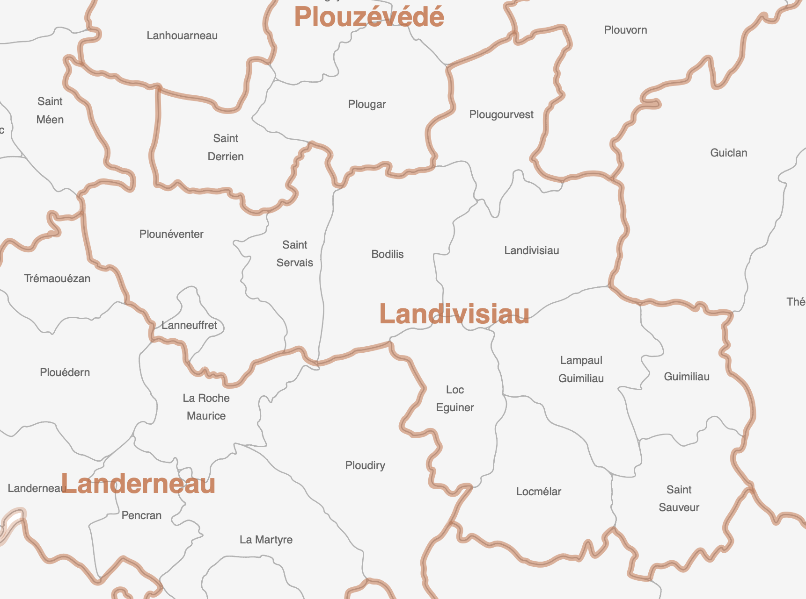
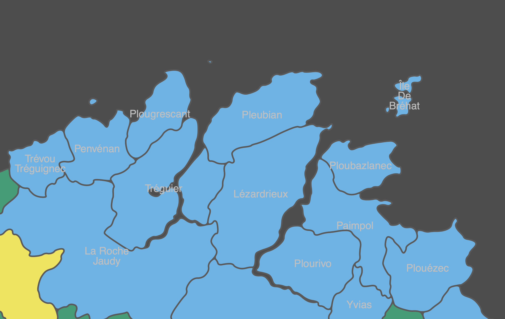
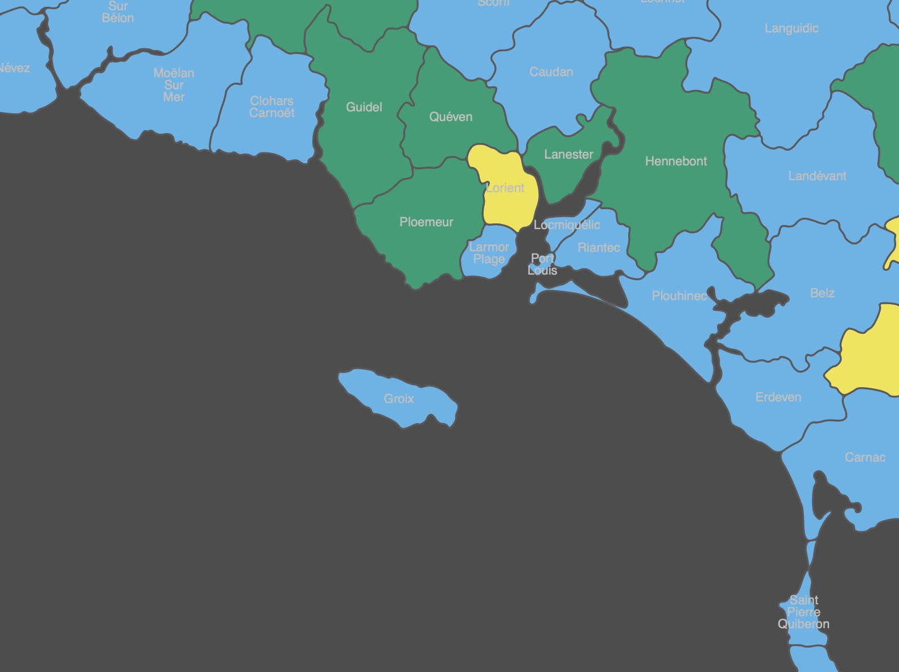
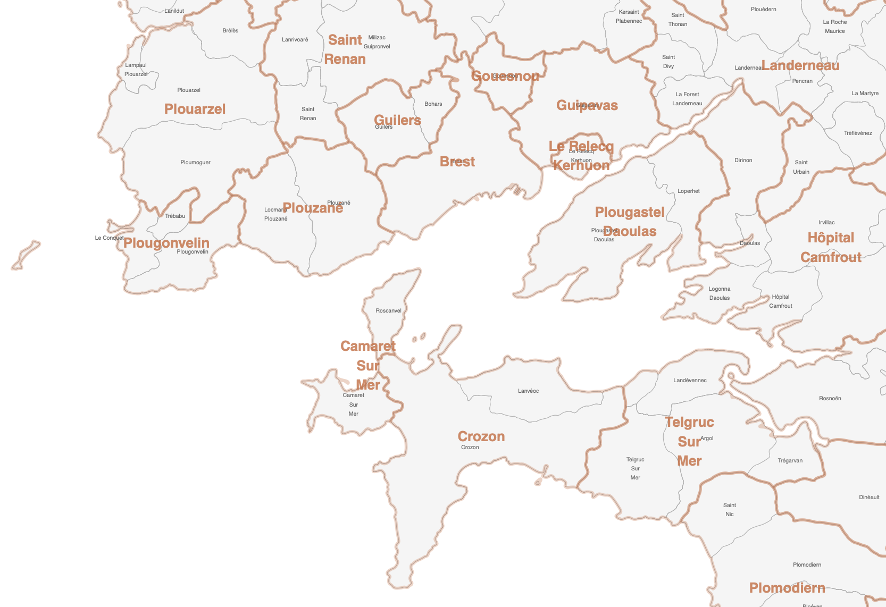
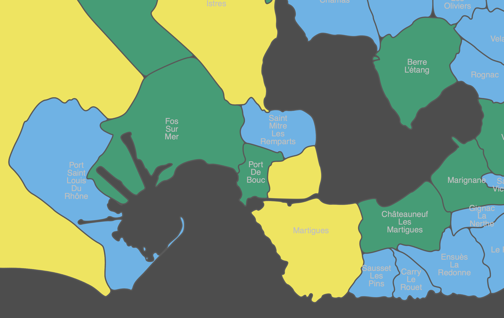
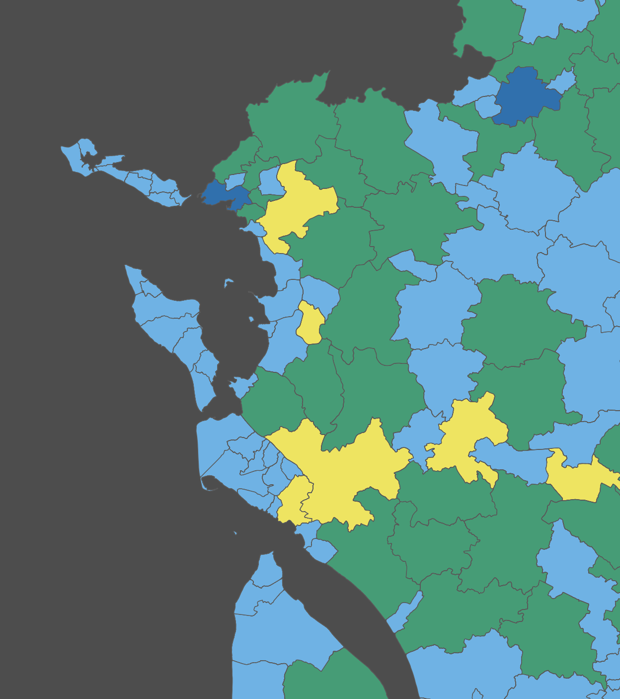

# whereismymap

How to make specific shapefiles on the go for some french data (postal code, ATIH geo-codes or other INSEE levels) when you need it.



See [here](outputs/bretagne.pdf) for a complete file and its legend.

<br>



## Context

### Context level 1

Most of the times, data that come to us did not contains geographical information that are perfect overlay of INSEE official codes (ie INSEE communes and IGN shapefile's) but often postal codes, sometimes adresses are found. To respect the original grain of datas it may be better to build specific shapefiles to build maps and view data as is (statistically unaltered).

It means project data to a specific shapefile and build your own shapefile as a union of a finer grained one (ie from IGN Admin Express to postal codes or to ATIH geo-codes).

### Context level 2

Often we have to make a map on the go and we ask, where is the shapefile to do it? This code is here as a recipe when needed.

### Context level 3

Big changes have happened in R ecosystem for maps, coming from rgeos and rgdal to sf and spatialEco affecting how ggplot2 works on this.

## Tree structure

```shell
.
├── LICENSE
├── README.md
├── docs
│   └── assets
├── intermediates
├── outputs
│   ├── bretagne.pdf
│   └── map_postal
├── raw_data
│   ├── ign_admin_express
│   └── laposte_hexamal
├── scripts
│   ├── p00_download_raw_data.R
│   ├── p01_keep_ign_d_interet.R
│   └── p02_make_specific_shp.R
└── whereismymap.Rproj
```

### 0. Download

- first step is to download Laposte Hexamal file : connecting between postal and INSEE codes maintained by Laposte data team.
- second step is to download IGN ADMIN-EXPRES COG CARTO shapefiles.

### 1. Extract what we need from IGN files

### 2. Make specific shapefiles

This one can be chunked in three steps:

- find a mapping between insee/ign codes and unit of geography which you want to map.
- use sf and spatialEco functions tu unify INSEE shapes to your unit
- then simplify and smooth shapes with rmapshaper and smoothr to obtain lighter map files

## Examples




<br>



<br>



<br>



<br>



